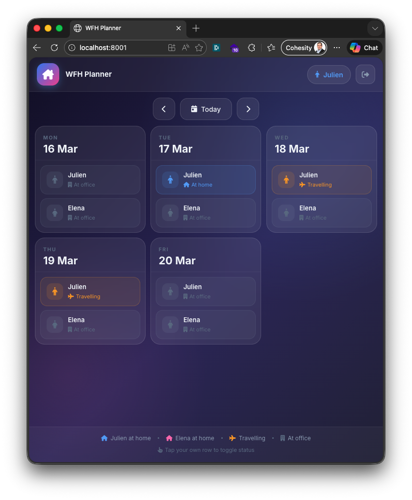

# WFH Planner

A beautiful Progressive Web App (PWA) for tracking Work From Home days for two users.

  



## Features

- **Week calendar** — Mon–Fri view, navigate week by week
- **Monthly calendar** — full-month overview, toggleable from the header (desktop)
- **Three statuses** per day: At office · At home · Travelling ✈️
- **Two users** — man (blue) and woman (pink), each with their own color theme
- **French public holidays** — auto-fetched from [data.gouv.fr](https://calendrier.api.gouv.fr) on startup, greyed out as "Férié / Day Off" (`FRENCHDAYOFF=true`)
- **Multi-device sync** — SQLite backend via Flask REST API
- **1-year sessions** — stay logged in across all devices
- **Profile page** — change email, language and password
- **French / English** — per-user language preference
- **Conflict notifications** — email alert when both users work from home the same day
- **ICS export** — download the other user's week as a calendar file
- **PWA** — installable on iOS and Android, works offline
- **iOS safe area** — supports Dynamic Island and home bar

## Stack

| Layer    | Technology |
|----------|-----------|
| Backend  | Python / Flask / SQLite |
| Frontend | Vanilla JS / Bootstrap 5 / Font Awesome 7 |
| Auth     | Bearer token (secrets.token_hex, 1-year expiry) |
| PWA      | Service Worker, Web App Manifest |

## Quick start

```bash
# 1. Clone and enter the project
cd WFH

# 2. Create and activate a virtual environment
python3 -m venv venv
source venv/bin/activate

# 3. Install dependencies
pip install -r requirements.txt

# 4. Configure
cp .env.example .env
# Edit .env to set user names, URL, SMTP, etc.

# 5. Run
python server.py
```

On first run the database is seeded and **randomly generated passwords are printed to the console** — save them.

Open `http://localhost:<PORT>` in your browser (default: [http://localhost:8001](http://localhost:8001)).

## Configuration

All settings live in `.env`:

| Variable        | Default     | Description                              |
|-----------------|-------------|------------------------------------------|
| `HOST`          | `0.0.0.0`   | Bind address                             |
| `PORT`          | `8001`      | HTTP port                                |
| `DEBUG`         | `false`     | Flask debug mode                         |
| `APP_URL`       | *(port)*    | Public URL — included in notification emails |
| `USER1_ID`      | `julien`    | Login username for user 1                |
| `USER1_USERNAME`| `julien`    | Same as ID (can differ)                  |
| `USER1_NAME`    | `Julien`    | Display name                             |
| `USER2_ID`      | `mallorie`  | Login username for user 2                |
| `USER2_USERNAME`| `mallorie`  | Same as ID (can differ)                  |
| `USER2_NAME`    | `Mallorie`  | Display name                             |
| `FRENCHDAYOFF`  | `false`     | Fetch French public holidays from data.gouv.fr and display as "Férié" |
| `EMAIL_DELAY`   | `900`       | Seconds to wait before sending a conflict email (default 15 min) |
| `SMTP_HOST`     |             | SMTP server — leave empty to disable emails |
| `SMTP_PORT`     | `587`       | SMTP port                                |
| `SMTP_USER`     |             | SMTP login                               |
| `SMTP_PASSWORD` |             | SMTP password                            |
| `SMTP_FROM`     |             | Sender address                           |

Passwords are **never stored in `.env`** — they are randomly generated (12 chars) on first startup.

### Email notifications

When both users are working from home on the same day, the other user receives an email in their own language. To avoid noise from rapid status changes, the email is **queued for `EMAIL_DELAY` seconds** and only sent if the conflict still exists when the timer fires. Toggling away from "home" before the timer expires cancels the email.

**Example (French):**
> **[Télétravail] Attention Conflit !**
> Julien sera également en télétravail le lundi 15 mars 2026.
> Lien vers le site : https://wfh.mousqueton.io

**Example (English):**
> **[WFH] Attention Conflict!**
> Julien will also work from home on Monday, March 15, 2026.
> Link to the site: https://wfh.mousqueton.io

Emails are only sent if the recipient has set an email address in their profile and `SMTP_HOST` is configured.

## Project structure

```
WFH/
├── server.py             # Flask backend (API + static serving)
├── requirements.txt      # Python dependencies
├── .env.example          # Configuration template
├── wfh.example.com.conf  # nginx virtual host template
├── INSTALL.md            # Production deployment guide
└── static/               # Public web assets
    ├── index.html        # Single-page app shell
    ├── app.js            # Frontend logic (i18n, calendar, auth)
    ├── styles.css        # Glassmorphism dark theme
    ├── sw.js             # Service worker (offline cache)
    ├── manifest.json     # PWA manifest
    ├── robots.txt        # Disallow all crawlers
    └── icons/            # PWA icons (192px, 512px)
```

## Production deployment

See [INSTALL.md](INSTALL.md) for full instructions including systemd service setup and nginx with Let's Encrypt SSL.

## Resetting the database

To change user names or force new passwords, stop the server, delete `wfh.db`, and restart:

```bash
rm wfh.db
python server.py
```
